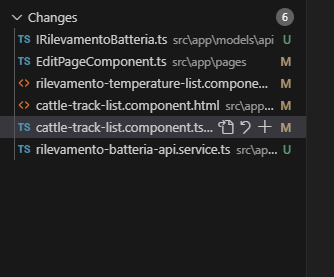
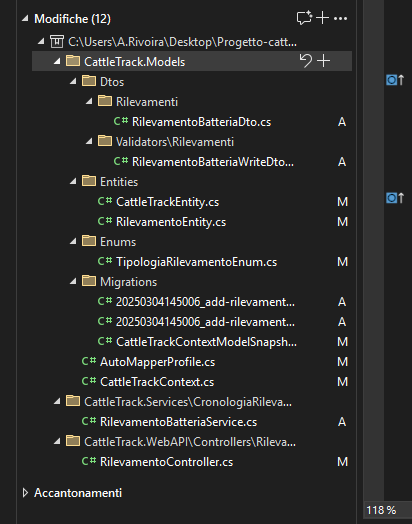

# 04/03
## Spiegazioni
### creazione component e interazione con backend
-
-
- RIPASSA E SISTEMA
- Batteria in fe, aggiunta di IRilevamentoBatteria in models -> api
- AutomapperProfile serve per indicare quale entity corrisponde a quale dto e permette la trasformazione di uno nell'altro (((auto mapper e context spiegare nel capitolo)))
- context, metodo onModelCreating serve per descrivere le relazioni delle entita e come vanno create dai file di migration
- es. rilevamentoEntity (hasDiscriminator/HasValue......) indica di non creare tabelle per le entita messe come valori sotto
ma di metterle sotto il discrminatore (tipologiaRilevamento), con i possibili valori indicati
## Done
### Argomento
- aggiunta tipologia di rilevamento per % batteria e classi, service ecc necessari
- aggiunto campo %batteria in fe cattletrackList

## To do
### Argomento
- aggiungere chiamata backend per avere ultima rilevazione batteria
-

 
 
 
 

# 05/03
## Spiegazioni
- ripasso del giorno prima 

## Done 
- tentativo metodo per ultima rilevazione

## To do
- finire metodo ultima rilevazione

 
 
 
 

# 05/03
## Spiegazioni
### Argomento
-
-

## Done
### Argomento
-
-

## To do
### Argomento
-
-

 
 
 
 